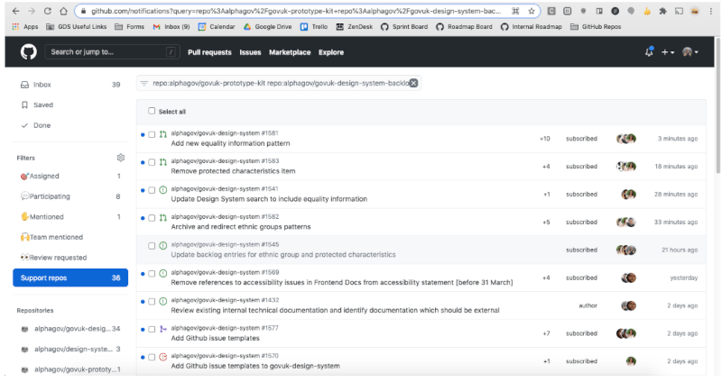

# Support channels

Turn on notifications for the following channels and check them regularly through the day:

## Slack

[#govuk-design-system][#govuk-design-system-xgov] channel on Cross Government Slack 
[#govuk-design-system][#govuk-design-system] channel on GDS Slack

You can choose to monitor other channels (like #design or #frontend), but we don’t officially support them.

### Inviting people to Slack

#### Joining Slack

Those with a government email address can just join the [cross government Slack].

There isn’t an up-to-date list of the email domains that have been approved as a government email address for this Slack instance ([this is the last available list][xgov-domain-list] but it’s not being kept up-to-date anymore).

#### Being invited to Slack

Occasionally we have people ask us for access to the cross-government Slack when their email hasn’t been approved as a government email address (see above). 

To invite someone, just say `/invite <email>`in Slackbot (your private bot channel). The invite request then goes to the Slack workspace admins who decide whether to approve it.

The good news is that once someone’s invite has been approved by the Slack workspace admins, that person can then invite others on the same email domain themselves by using `/invite`.

#### Single channel guests
We have previously added people outside the organisation to the GDS Support Slack channel in order to provide support if they’re undertaking a piece of work in government but can’t get on cross government Slack. Ideally the period they need to be invited for won’t be very long.

To add a single channel guest:

1. Follow the [guidance to invite the guest] (under ‘Guest accounts’). Cc in another member of our team for visibility on the IT ticket.
2. Post a message on our team Slack telling them about the single channel guest.
3. When the user is added to the support Slack channel, post the following messages there:
  - “Hello x and welcome!”
  - “Hello everyone. X works for an external organisation on behalf of GDS and has joined this channel temporarily to get support on using the Design System.”

Create a team calendar event for checking the day after the account closure date set in the IT ticket whether the person has been removed from the Slack support channel. If not, leave a message on the IT ticket to remove the user.

## Github

- govuk-frontend [issues][govuk-frontend-issues] and [pull requests][govuk-frontend-prs]
- govuk-design-system [issues][govuk-design-system-issues] and [pull requests][govuk-design-system-prs]
- govuk-design-system-backlog [issues][govuk-design-system-backlog-issues]

Whilst on daily support, any new pull requests or issues raised that day should be reviewed.

All new pull requests should be added to the sprint board. At the next stand up the team will identify reviewers.

For new issues you should:

1. Flag in the team Slack channel if you think the issue meets the below high-priority criteria and add `high-priority` label:
  - A bug which renders something unusable
  - A WCAG failure
  - An issue which has been raised by users on more than 5 occasions (tracked by adding comments to the GitHub issue each time it appears on support)
2. The `submitted-by-user` label should be added to any issues opened on behalf of a user. This will help us further down the line when we do an analysis.
3. Add estimate labels
	- `🕔 hours`: a well understood issue which we expect to take less than a day to resolve. Could be something that community could be involved in (eg. first timer issues).
  - `🕔 days`: a few unknowns, but we roughly know what’s involved. We’d expect it to take less than a week to resolve. May be a good thing to pair on.
  - `🕔 weeks`: This is complicated and will require a lot of effort from the team, taking more than a week to resolve. May need breaking down into smaller pieces of work.
4. Add other appropriate labels such as related components and patterns or themes

If you need help from the team to triage an issue, use the team Slack channel to ask.

### How to see new issues, PRs and comments on our repos

There is a view you can set up in GitHub which will notify you when new issues / PRs  / comments are added to a repository. This could be useful when you are on support.

Go to your icon in top-right corner > Settings > Notifications

Skip to ‘Watching’. Untick ‘Email’ and tick ‘Web and Mobile’.

Now select the repositories you want to “watch”. This should be:

- [alphagov/govuk-design-system]
- [alphagov/govuk-frontend]
- [alphagov/govuk-design-system-backlog]

You can watch each of these repositories by selecting the ‘Watch’ drop-down in the top right and selecting ‘All activity’.

To get the notifications view, click on [this link][github-notifications-view]

It should look like this:

### Recording new queries relating to an existing issue 

If you receive a query regarding an issue which already exists on one of our repositories, add a comment to that issue noting that this has appeared on support that day. When we reach 5 instances of this, add the “high priority” label and flag in the team Slack channel.

### Responding to Community Backlog issues and comments

- Make sure you are responding to comments that need our team’s answer. 
- Keep an eye on the [latest comments]
- To have an overview, check the [project board][govuk-design-system-backlog-issues]

### Adding newly raised issues to the board

We ask contributors to [get in touch with us when they raise a new issue][raise-issue] in the backlog. 

This is so we can help them:
- briefly review the issue to make sure it’s appropriate
- add it to the [GitHub projects ‘list view’][govuk-design-system-backlog-issues-list] of the backlog

## Email

Emails sent to our support email address are automatically turned into [Zendesk] tickets. If you are part of the support rota you will be given access to Zendesk. See this guide on [how to use Zendesk][Zendesk-help] for more details.

### Mailing list

We have a mailing list for users to subscribe to emails about future updates and events.

In most circumstances users can sign up to the mailing list using the link on the Design System homepage, which takes them to a Mailchimp landing page with a signup form.

However if for whatever reason the Mailchimp form isn’t an option then users can also email the support inbox to ask for us to sign them up.

If a user sends an email asking to join the mailing list, but without having selected any of the options for things they are interested in, we should reply with something like

> Thank you for your interest in emails from the GOV.UK Design System team.
>
> It looks like you have not selected anything under the types of emails you’d like to receive. Could you reply with at least one option selected?

Once the user has clarified which topics they want to hear about you can add them to mailchimp manually by:

1. [Logging into mailchimp][mailchimp]. Credentials can be found in the Design System team’s Bitwarden account.
2. Navigate to Audience (left hand sidebar) > All contacts > Add contacts > Add a subscriber
3. Fill out the Add subscriber form
  - Enter the user’s email address
  - Check the topics the user expressed interest in
  - Check the boxes at the bottom relating to the person giving you permission to email them and to update their profile if they already have one
  - Click subscribe
4. Go back to the ticket and let the user know that they’ve been added:

> We've added you manually to our mailing list with the requested settings. Please feel free to contact us in future if you require further assistance.

## Analysing our support requests

On a monthly basis, we will pull all the tickets from GitHub repos, slack and zendesk into the [support log spreadsheet]. We will be able to search and filter by time, channel and tag. We will use this data to identify areas the users need the most support and define epics/stories from that or plan further research. 

We also hold bi-weekly sessions to give tags to Slack messages. 

[#govuk-design-system]: https://gds.slack.com/messages/CAF8JA25U
[#govuk-design-system-xgov]: https://ukgovernmentdigital.slack.com/messages/govuk-design-system
[alphagov/govuk-design-system]: https://github.com/alphagov/govuk-design-system
[alphagov/govuk-frontend]: https://github.com/alphagov/govuk-frontend
[alphagov/govuk-design-system-backlog]: https://github.com/alphagov/govuk-design-system-backlog
[cross government Slack]: https://ukgovernmentdigital.slack.com/
[github-notifications-view]: https://github.com/notifications?query=repo%3Aalphagov%2Fgovuk-design-system-backlog+repo%3Aalphagov%2Fgovuk-design-system+repo%3Aalphagov%2Fgovuk-frontend+
[govuk-design-system-issues]: https://github.com/alphagov/govuk-design-system/issues
[govuk-design-system-prs]: https://github.com/alphagov/govuk-design-system/pulls
[govuk-design-system-backlog-issues]: https://github.com/orgs/alphagov/projects/43
[govuk-design-system-backlog-issues-list]: https://github.com/orgs/alphagov/projects/43/views/2
[govuk-frontend-issues]: https://github.com/alphagov/govuk-frontend/issues
[govuk-frontend-prs]: https://github.com/alphagov/govuk-frontend/pulls
[guidance to invite the guest]: https://sites.google.com/a/digital.cabinet-office.gov.uk/gds/information-management/using-online-tools-at-gds/use-gds-slack
[latest comments]: https://github.com/alphagov/govuk-design-system-backlog/issues?q=is%3Aissue+is%3Aopen+sort%3Aupdated-desc
[mailchimp]: https://login.mailchimp.com/
[raise-issue]: https://design-system.service.gov.uk/community/propose-a-component-or-pattern/#2-raise-an-issue
[support log spreadsheet]: https://docs.google.com/document/d/1G-TN0uXeKchwhHZnmPveX5YteXi3uSl0Rf5vtg-J5l4/edit?usp=sharing
[support model blueprint]: https://docs.google.com/drawings/d/1ox2FK9q6GRyY_zvhSuFIOT9-a6Wd-R4-kP8OlrzVCvk/edit
[xgov-domain-list]: https://github.com/bruntonspall/xgovslackbot/blob/ae6664437dadb2aef4c21ab97c2818f2ca5f9604/app/domains.js#L9
[Zendesk]: https://govuk.zendesk.com/agent/dashboard
[Zendesk-help]: https://docs.google.com/presentation/d/1VrDAuCm5qm6ULNGRco_deB7EIFf95bHFDlqG-yvLQi4/edit#slide=id.p17

